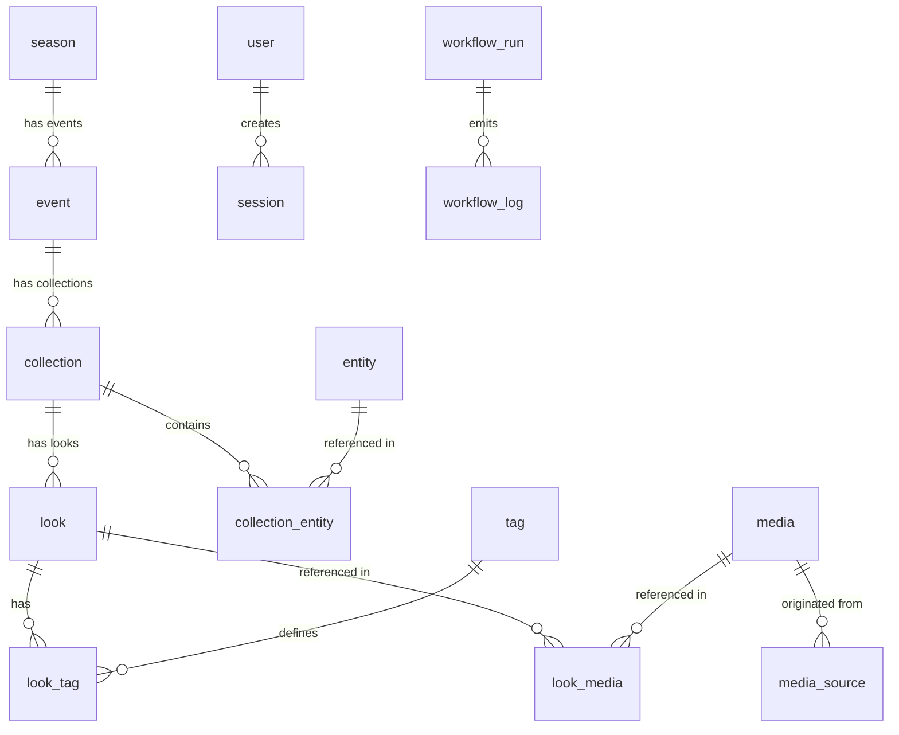

# Strut Database Schema Documentation

This document describes the SQLite database schema designed for **Strut**, based on the product scope outlined in `docs/architecture.md`. 

While the production architecture targets Cloudflare D1, this relational schema has been designed and implemented in SQLite to support initial development. The tables are configured with proper foreign key relationships, cascade deletes, data types, and indexes.

---

## Entity Relationship Diagram

---

## Schema Reference

### 1. `season`
Represents fashion season editions (e.g. Spring/Summer 2026).
- `id` (INTEGER, PK, AUTOINCREMENT): Unique identifier.
- `year` (INTEGER, NOT NULL): The calendar year (e.g. 2026).
- `label` (TEXT, NOT NULL): Controlled label (e.g. "Spring/Summer", "Autumn/Winter").
- `custom_label` (TEXT, NULL): Optional custom or designer-specific edition name.

### 2. `event`
A specific edition of a fashion show event.
- `id` (INTEGER, PK, AUTOINCREMENT): Unique identifier.
- `name` (TEXT, NOT NULL): Event name.
- `slug` (TEXT, NOT NULL, UNIQUE): URL-friendly unique identifier.
- `location` (TEXT, NULL): Venue or city name.
- `source_urls` (TEXT, NOT NULL): JSON array of crawled urls.
- `start_date` (TEXT, NOT NULL): ISO start date (`YYYY-MM-DD`).
- `end_date` (TEXT, NOT NULL): ISO end date (`YYYY-MM-DD`).
- `season_id` (INTEGER, NOT NULL, FK): References `season.id`.
- `created_at` (INTEGER, NOT NULL): Creation UNIX timestamp.
- `updated_at` (INTEGER, NOT NULL): Update UNIX timestamp.

### 3. `entity` (Creative Entity)
Designers, brands, labels, institutions, or other fashion actors.
- `id` (INTEGER, PK, AUTOINCREMENT): Unique identifier.
- `name` (TEXT, NOT NULL): Canonical display name.
- `instagram_handle` (TEXT, NULL, UNIQUE): Unique verified Instagram handle.
- `website` (TEXT, NULL): Official website URL.
- `classifications` (TEXT, NULL): JSON list of string classifications (e.g., `["Designer", "Brand"]`).
- `created_at` (INTEGER, NOT NULL): Creation UNIX timestamp.
- `updated_at` (INTEGER, NOT NULL): Update UNIX timestamp.

### 4. `collection`
Groups of looks belonging to an event.
- `id` (INTEGER, PK, AUTOINCREMENT): Unique identifier.
- `event_id` (INTEGER, NOT NULL, FK): References `event.id` (ON DELETE CASCADE).
- `name` (TEXT, NOT NULL): Collection name.
- `slug` (TEXT, NOT NULL): Unique slug per event (Index `collection_event_slug_idx`).
- `status` (TEXT, NOT NULL): Publication status (`published`, `needs_review`, `draft`).
- `created_at` (INTEGER, NOT NULL): Creation UNIX timestamp.
- `updated_at` (INTEGER, NOT NULL): Update UNIX timestamp.

### 5. `collection_entity`
Junction table mapping creative entities to collections.
- `collection_id` (INTEGER, NOT NULL, FK): References `collection.id` (ON DELETE CASCADE).
- `entity_id` (INTEGER, NOT NULL, FK): References `entity.id` (ON DELETE CASCADE).
- `role` (TEXT, NOT NULL): Creative role (`primary` or `secondary`).
- `display_order` (INTEGER, NOT NULL): Rendering order sequence.
- Primary Key: `(collection_id, entity_id)`

### 6. `look`
An individual outfit from a collection.
- `id` (INTEGER, PK, AUTOINCREMENT): Unique identifier.
- `collection_id` (INTEGER, NOT NULL, FK): References `collection.id` (ON DELETE CASCADE).
- `created_at` (INTEGER, NOT NULL): Creation UNIX timestamp.
- `updated_at` (INTEGER, NOT NULL): Update UNIX timestamp.

### 7. `tag`
Vocabulary definitions for visual features.
- `id` (INTEGER, PK, AUTOINCREMENT): Unique identifier.
- `name` (TEXT, NOT NULL): Tag value (e.g. "Floral", "Red").
- `category` (TEXT, NOT NULL): Category group (e.g. "pattern", "color").
- Unique Constraint: `(category, name)`

### 8. `look_tag`
Junction table linking looks to tags.
- `look_id` (INTEGER, NOT NULL, FK): References `look.id` (ON DELETE CASCADE).
- `tag_id` (INTEGER, NOT NULL, FK): References `tag.id` (ON DELETE CASCADE).
- Primary Key: `(look_id, tag_id)`

### 9. `media`
Archived media assets (images and videos).
- `id` (INTEGER, PK, AUTOINCREMENT): Unique identifier.
- `type` (TEXT, NOT NULL): Asset type (`image` or `video`).
- `r2_key` (TEXT, NULL): Archival object key in R2.
- `cf_image_id` (TEXT, NULL): Cloudflare Image rendering identifier.
- `cf_stream_id` (TEXT, NULL): Cloudflare Stream video playback identifier.
- `hash` (TEXT, NOT NULL): Deterministic file hash used for deduplication (indexed).
- `duration` (REAL, NULL): Video duration in seconds.
- `width` (INTEGER, NULL): Dimension width.
- `height` (INTEGER, NULL): Dimension height.
- `status` (TEXT, NOT NULL): Visibility status (`hidden`, `published`).
- `created_at` (INTEGER, NOT NULL): Ingestion UNIX timestamp.
- `updated_at` (INTEGER, NOT NULL): Update UNIX timestamp.

### 10. `media_source`
Tracks original ingestion sources (e.g. Instagram posts) for deduplicated media.
- `id` (INTEGER, PK, AUTOINCREMENT): Unique identifier.
- `media_id` (INTEGER, NOT NULL, FK): References `media.id` (ON DELETE CASCADE).
- `instagram_post_url` (TEXT, NOT NULL): Instagram post source link.
- `originating_account` (TEXT, NOT NULL): Instagram profile handle that posted it.
- `post_date` (INTEGER, NOT NULL): Ingestion post date timestamp.
- `source_metadata` (TEXT, NULL): JSON string storing extra scraper detail.
- `created_at` (INTEGER, NOT NULL): Ingestion UNIX timestamp.

### 11. `look_media`
Junction table linking looks to media.
- `look_id` (INTEGER, NOT NULL, FK): References `look.id` (ON DELETE CASCADE).
- `media_id` (INTEGER, NOT NULL, FK): References `media.id` (ON DELETE CASCADE).
- `timestamps` (TEXT, NULL): JSON array of timestamps for video segments (e.g. `[{"start": 12.0, "end": 15.5}]`).
- Primary Key: `(look_id, media_id)`

### 12. `user`
Administrator account profiles authenticated via Facebook OAuth.
- `id` (INTEGER, PK, AUTOINCREMENT): Unique identifier.
- `facebook_user_id` (TEXT, NOT NULL, UNIQUE): Facebook OAuth profile ID.
- `email` (TEXT, NULL): Admin email address.
- `name` (TEXT, NOT NULL): Admin full name.
- `created_at` (INTEGER, NOT NULL): Creation UNIX timestamp.
- `updated_at` (INTEGER, NOT NULL): Update UNIX timestamp.

### 13. `session`
Secure cookie-backed sliding admin login sessions.
- `id` (TEXT, PK): Opaque session token.
- `user_id` (INTEGER, NOT NULL, FK): References `user.id` (ON DELETE CASCADE).
- `expires_at` (INTEGER, NOT NULL): UNIX expiry timestamp.
- `created_at` (INTEGER, NOT NULL): Login UNIX timestamp.
- `updated_at` (INTEGER, NOT NULL): Update UNIX timestamp.

### 14. `meta_integration`
Encrypted Meta Page / Instagram token integrations for workflows.
- `id` (INTEGER, PK, AUTOINCREMENT): Unique identifier.
- `facebook_page_id` (TEXT, NOT NULL): Target Facebook page.
- `instagram_account_id` (TEXT, NOT NULL): Target Instagram professional page.
- `access_token_encrypted` (TEXT, NOT NULL): Access token encrypted at rest.
- `expires_at` (INTEGER, NULL): Expiry timestamp of the meta token.
- `health_status` (TEXT, NOT NULL): Status of integration health (`healthy`, `invalid`, `expired`).
- `last_checked_at` (INTEGER, NOT NULL): Health check UNIX timestamp.
- `created_at` (INTEGER, NOT NULL): Ingestion UNIX timestamp.
- `updated_at` (INTEGER, NOT NULL): Update UNIX timestamp.

### 15. `workflow_run`
Tracks workflow execution processes (discovery and collection ingestion).
- `id` (TEXT, PK): UUID for the execution run.
- `workflow_name` (TEXT, NOT NULL): Target workflow (`event_discovery`, `collection_ingestion`).
- `status` (TEXT, NOT NULL): Run status (`running`, `completed`, `failed`, `needs_review`).
- `started_at` (INTEGER, NOT NULL): Execution start UNIX timestamp.
- `completed_at` (INTEGER, NULL): Execution completion UNIX timestamp.
- `run_metadata` (TEXT, NULL): JSON string of model logs, prompt versions, and token limits.

### 16. `workflow_log`
Detailed structured logging with evidence and reviews.
- `id` (INTEGER, PK, AUTOINCREMENT): Unique identifier.
- `run_id` (TEXT, NOT NULL, FK): References `workflow_run.id` (ON DELETE CASCADE).
- `stage` (TEXT, NOT NULL): Workflow phase (`scraped`, `dedup`, `grouping`, `tagging`).
- `severity` (TEXT, NOT NULL): Alert severity (`info`, `warning`, `error`).
- `message` (TEXT, NOT NULL): Detailed log message text.
- `evidence_urls` (TEXT, NULL): JSON list of resource links proving the action.
- `related_entity_ids` (TEXT, NULL): JSON payload linking this log entry to database rows (like looks or collections).
- `needs_review` (INTEGER, NOT NULL DEFAULT 0): Boolean indicating admin attention is required.
- `raw_payload_r2_key` (TEXT, NULL): R2 key referencing raw scraped HTML payload.
- `llm_payload_r2_key` (TEXT, NULL): R2 key referencing structured prompt inputs/outputs.
- `created_at` (INTEGER, NOT NULL): Ingestion UNIX timestamp.
- Index: `workflow_log_run_id_idx`
